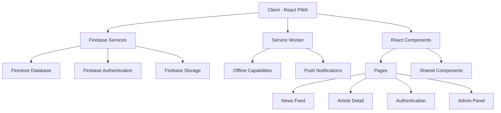
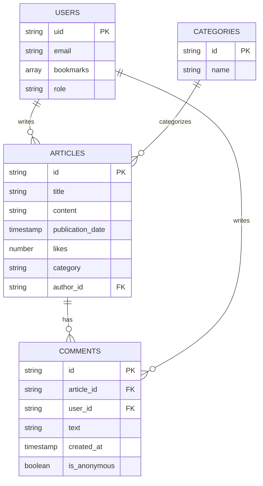

# Finance News PWA - Detailed Architecture Plan

This document outlines the comprehensive architecture plan for the Finance News Progressive Web Application (PWA). The plan follows a phased approach to implementation, ensuring a structured and manageable development process.

## 1. Project Architecture Overview



## 2. Data Model



## 3. Implementation Plan

### 🏗️ Phase 1: Foundation Setup

#### 1. Firebase Setup & Database Collections

**Firestore Collections Structure:**

```
/articles
  /{articleId}
    - title: string
    - content: string
    - publication_date: timestamp
    - likes: number
    - category: string
    - author_id: string (reference to users collection)

/users
  /{userId}
    - email: string
    - bookmarks: array of article IDs
    - role: string ("admin" or "user")

/comments
  /{commentId}
    - article_id: string
    - user_id: string
    - text: string
    - created_at: timestamp
    - is_anonymous: boolean

/categories
  /{categoryId}
    - name: string
```

**Firebase Configuration:**

We'll enhance the existing Firebase configuration to include all required services:

```javascript
// src/firebase/firebaseConfig.js
import { initializeApp } from "firebase/app";
import { getFirestore } from "firebase/firestore";
import { getAuth } from "firebase/auth";
import { getStorage } from "firebase/storage";

const firebaseConfig = {
  // Your existing config
};

// Initialize Firebase
const app = initializeApp(firebaseConfig);
const db = getFirestore(app);
const auth = getAuth(app);
const storage = getStorage(app);

export { app, db, auth, storage };
```

#### 2. Basic App Structure & Routing

**Folder Structure:**

```
src/
├── components/
│   ├── layout/
│   │   ├── Header.js
│   │   ├── Footer.js
│   │   └── Navigation.js
│   ├── articles/
│   │   ├── ArticleCard.js
│   │   ├── ArticleList.js
│   │   └── ArticleDetail.js
│   ├── auth/
│   │   ├── LoginForm.js
│   │   └── RegisterForm.js
│   └── common/
│       ├── Button.js
│       ├── Loading.js
│       └── ErrorMessage.js
├── pages/
│   ├── HomePage.js
│   ├── ArticleDetailPage.js
│   ├── LoginPage.js
│   ├── RegisterPage.js
│   └── AdminPage.js
├── firebase/
│   ├── firebaseConfig.js
│   ├── articles.js
│   ├── auth.js
│   └── comments.js
├── hooks/
│   ├── useAuth.js
│   ├── useArticles.js
│   └── useComments.js
├── context/
│   ├── AuthContext.js
│   └── ArticleContext.js
├── utils/
│   ├── dateFormatter.js
│   └── textFormatter.js
└── App.js
```

**Routing Setup:**

```javascript
// src/App.js
import { BrowserRouter, Routes, Route } from 'react-router-dom';
import { AuthProvider } from './context/AuthContext';
import HomePage from './pages/HomePage';
import ArticleDetailPage from './pages/ArticleDetailPage';
import LoginPage from './pages/LoginPage';
import RegisterPage from './pages/RegisterPage';
import AdminPage from './pages/AdminPage';
import Header from './components/layout/Header';
import Footer from './components/layout/Footer';
import Navigation from './components/layout/Navigation';

function App() {
  return (
    <AuthProvider>
      <BrowserRouter>
        <div className="app-container">
          <Header />
          <main className="main-content">
            <Routes>
              <Route path="/" element={<HomePage />} />
              <Route path="/article/:id" element={<ArticleDetailPage />} />
              <Route path="/login" element={<LoginPage />} />
              <Route path="/register" element={<RegisterPage />} />
              <Route path="/admin" element={<AdminPage />} />
            </Routes>
          </main>
          <Navigation />
          <Footer />
        </div>
      </BrowserRouter>
    </AuthProvider>
  );
}

export default App;
```

### 🔐 Phase 2: Authentication

#### 3. Firebase Authentication

**Authentication Context:**

```javascript
// src/context/AuthContext.js
import { createContext, useContext, useState, useEffect } from 'react';
import { auth } from '../firebase/firebaseConfig';
import { 
  onAuthStateChanged, 
  signInWithEmailAndPassword, 
  createUserWithEmailAndPassword, 
  signOut 
} from 'firebase/auth';

const AuthContext = createContext();

export function useAuth() {
  return useContext(AuthContext);
}

export function AuthProvider({ children }) {
  const [currentUser, setCurrentUser] = useState(null);
  const [loading, setLoading] = useState(true);

  function login(email, password) {
    return signInWithEmailAndPassword(auth, email, password);
  }

  function register(email, password) {
    return createUserWithEmailAndPassword(auth, email, password);
  }

  function logout() {
    return signOut(auth);
  }

  useEffect(() => {
    const unsubscribe = onAuthStateChanged(auth, (user) => {
      setCurrentUser(user);
      setLoading(false);
    });

    return unsubscribe;
  }, []);

  const value = {
    currentUser,
    login,
    register,
    logout
  };

  return (
    <AuthContext.Provider value={value}>
      {!loading && children}
    </AuthContext.Provider>
  );
}
```

### 🎨 Phase 3: Core Features

#### 4. News Feed Page

**Articles Service:**

```javascript
// src/firebase/articles.js
import { db } from './firebaseConfig';
import { 
  collection, 
  getDocs, 
  getDoc, 
  doc, 
  query, 
  orderBy, 
  limit,
  addDoc,
  updateDoc,
  increment
} from 'firebase/firestore';

// Get all articles
export async function getArticles(limitCount = 10) {
  const articlesRef = collection(db, 'articles');
  const q = query(articlesRef, orderBy('publication_date', 'desc'), limit(limitCount));
  const snapshot = await getDocs(q);
  
  return snapshot.docs.map(doc => ({
    id: doc.id,
    ...doc.data()
  }));
}

// Get a single article by ID
export async function getArticleById(id) {
  const docRef = doc(db, 'articles', id);
  const docSnap = await getDoc(docRef);
  
  if (docSnap.exists()) {
    return {
      id: docSnap.id,
      ...docSnap.data()
    };
  } else {
    throw new Error('Article not found');
  }
}

// Like an article
export async function likeArticle(id) {
  const articleRef = doc(db, 'articles', id);
  await updateDoc(articleRef, {
    likes: increment(1)
  });
}

// Add a new article (admin only)
export async function addArticle(articleData) {
  const articlesRef = collection(db, 'articles');
  const newArticle = await addDoc(articlesRef, {
    ...articleData,
    likes: 0,
    publication_date: new Date()
  });
  
  return newArticle.id;
}
```

#### 5. Article Detail Page

**Comments Service:**

```javascript
// src/firebase/comments.js
import { db } from './firebaseConfig';
import { 
  collection, 
  addDoc, 
  getDocs, 
  query, 
  where, 
  orderBy 
} from 'firebase/firestore';

// Get comments for an article
export async function getCommentsByArticleId(articleId) {
  const commentsRef = collection(db, 'comments');
  const q = query(
    commentsRef, 
    where('article_id', '==', articleId),
    orderBy('created_at', 'desc')
  );
  
  const snapshot = await getDocs(q);
  
  return snapshot.docs.map(doc => ({
    id: doc.id,
    ...doc.data()
  }));
}

// Add a comment to an article
export async function addComment(commentData) {
  const commentsRef = collection(db, 'comments');
  const newComment = await addDoc(commentsRef, {
    ...commentData,
    created_at: new Date()
  });
  
  return newComment.id;
}
```

## 4. PWA Configuration

We'll enable the service worker by changing the registration in `index.js`:

```javascript
// src/index.js
// Change from:
serviceWorkerRegistration.unregister();

// To:
serviceWorkerRegistration.register();
```

We'll also enhance the service worker to cache API responses for offline use:

```javascript
// src/service-worker.js
// Add this to the existing service worker file

// Cache the Firestore data for offline use
registerRoute(
  ({ url }) => url.origin === 'https://firestore.googleapis.com',
  new StaleWhileRevalidate({
    cacheName: 'firebase-data',
    plugins: [
      new ExpirationPlugin({
        maxEntries: 100,
        maxAgeSeconds: 60 * 60 * 24, // 1 day
      }),
    ],
  })
);
```

## 5. Additional Dependencies Needed

```
npm install react-router-dom tailwindcss @headlessui/react @heroicons/react date-fns
```

## 6. Tailwind CSS Setup

```javascript
// Install Tailwind CSS
// npx tailwindcss init

// tailwind.config.js
module.exports = {
  content: [
    "./src/**/*.{js,jsx,ts,tsx}",
  ],
  theme: {
    extend: {
      colors: {
        primary: {
          light: '#4da6ff',
          DEFAULT: '#0066cc',
          dark: '#004c99',
        },
      },
    },
  },
  plugins: [],
}
```

## 7. Implementation Strategy

1. **Start with Firebase Setup**:
   - Enhance the existing Firebase configuration
   - Create Firestore collections and security rules
   - Add sample data for testing

2. **Set up Basic App Structure**:
   - Implement the folder structure
   - Set up React Router
   - Create placeholder components

3. **Implement Authentication**:
   - Set up the AuthContext
   - Create login and registration forms
   - Implement protected routes

4. **Develop Core Features**:
   - Build the News Feed page
   - Implement the Article Detail page
   - Add commenting functionality

5. **Add Admin Functionality**:
   - Create the Admin page
   - Implement article creation and editing
   - Set up admin-only routes

6. **Enhance PWA Features**:
   - Enable offline access
   - Implement caching strategies
   - Add installability

7. **Polish and Test**:
   - Ensure responsive design
   - Test on various devices
   - Optimize performance